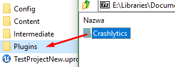

# Crashlytics

The **Crashlytics** plugin lets you integrate out-of-the-box automatic crash reporting solution for iOS & Android into your [Unreal Engine 4](http://www.unrealengine.com) project.
Spend less time finding and more time fixing crashes. Named the #1 performance SDK on both iOS and Android, Crashlytics provides deep and actionable insights, even the exact line of code your app crashed on.

* **Current version:** 1.0.1
* **Binaries compiled for:** Unreal Engine 4.13
* **Required Unreal Engine 4.13 or above.**

## Features
* Real-time crash reporting tool
* Information about the number of crashes and affected users
* Provides the exact line of code your app crashed on
* Notifications about crashes via e-mail
* Works with dev & shipping builds
* Out-of-the-box for iOS & Android
* Additional SDK included
* Works with Blueprint-only & source code projects
* Works with Launcher & GitHub UE4 versions

## Blueprint nodes


## Setup
1. Copy this folder to the *Plugins* folder located in the main path of your project.

    

2. Enable *Crashlytics* in *Edit -> Plugins -> Misc -> Crashlytics*.

    

3. Go to _Edit -> Project Settings -> Crashlytics_ and set your _Crashlytics API Key_. You can obtain it on [fabric.io](http://www.fabric.io)

4. Paste the following code to field called _Additional Plist Data_ in _Project Settings -> IOS_:

    ```xml
    <key>Fabric</key><dict><key>APIKey</key><string>[API_KEY]</string><key>Kits</key><array><dict><key>KitInfo</key><dict/><key>KitName</key><string>Crashlytics</string></dict></array></dict>
    ```

    and replace _API_KEY_ with _Crashlytics API Key_.
    
5. Turn on _Generate dSYM bundle for third party crash tools_ in _Project Settings_.

## Uploading symbols
You need to upload symbols in order to properly handling crashes. You should do this after every submission to App Store or Google Play.

### iOS
1. Find your Xcode project:

    a. If you are directly packaging on Mac, go to _/[PATH_TO_PROJECT_ON_MAC]/Intermediate/ProjectFilesIOS/_

    b. If you are packaging with remote connection from Windows to Mac, go to _/Users/[USER_NAME]/UE4/Builds/[COMPUTER_NAME]/[PATH_TO_PROJECT_ON_WINDOWS]/Binaries/IOS/_

2. Copy content from _[PLUGIN_FOLDER]/Extras/iOS_ to path from previous point. Now you should have _Crashlytics_ and _Fabric_ folders in folder from previous point.

3. Run _[PROJECT_NAME].xcodeproj_ or _UE4_FromPC.xcodeproj_

4. In the _Project Navigator_, click on your project and add a new run script build phase

5. Add following code to new run script build phase with replacing _[API_KEY]_ and _[BUILD_SECRET]_

        ./Fabric/run [API_KEY] [BUILD_SECRET]

6. Build your project by clicking on _Product -> Build_

7. Go to Fabric dashboard -> Settings -> Apps -> Your game -> Missing DSYMs. Here upload new DSYMs from [PROJECT_FOLDER]/Binaries/IOS.

### Android

1. Add new _ant_ system variable.

2. Go to _[PATH_TO_PROJECT]/Intermediate/Android/APK/_

3. Open _Command Prompt (Terminal)_ and run following command:

        ant crashlytics-symbols

Plugin icon designed by _Freepik_.
